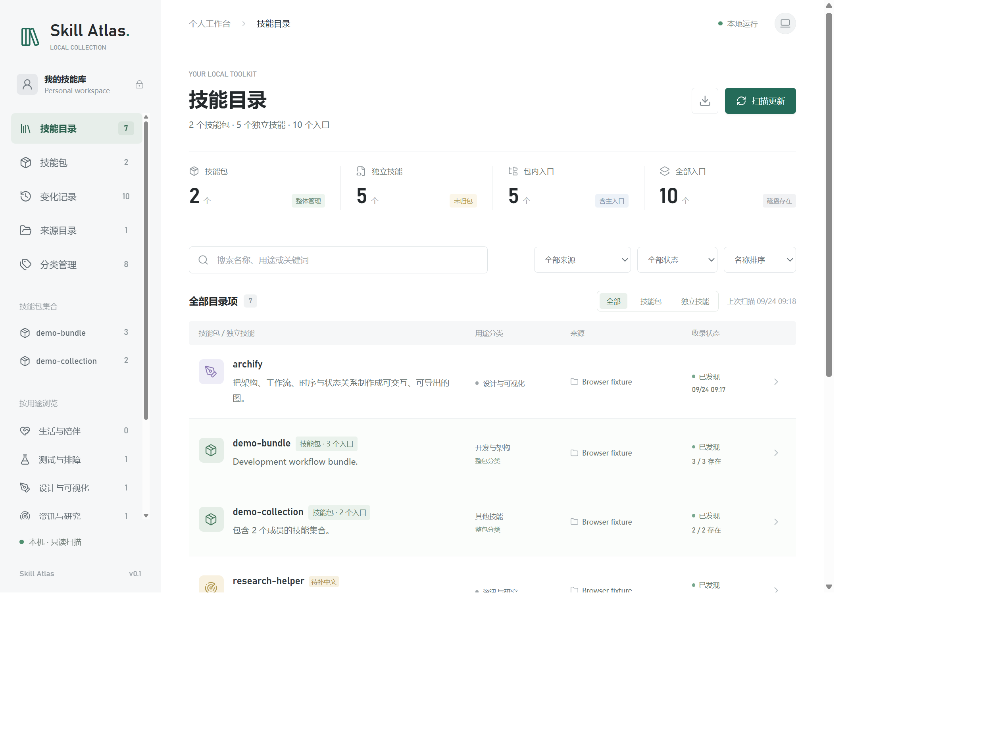

# Skill Atlas

本地技能目录。跨目录收录 `SKILL.md`，按技能包与独立技能组织，按名称和用途搜索，保留新增、内容更新、路径缺失及重新发现记录。

当前为 **0.1.0 预览版**。无账号、无云端服务、无遥测，不安装或执行被收录的技能。



图中使用隔离测试目录，不包含真实用户清单。

## 启动

需要 Node.js 22 或 24。获取源码后，在项目目录安装锁定依赖并启动：

```powershell
npm ci --ignore-scripts --no-audit --no-fund
npm start
```

若本地 npm 镜像无法连接，可在安装命令后加 `--registry=https://registry.npmjs.org`。无需全局安装或管理员权限。

浏览器访问终端输出的地址，默认 http://127.0.0.1:4317。端口被其他程序占用时自动尝试后续端口；服务只监听本机，不对局域网开放。使用 `Ctrl+C` 停止。

本地已验证 Windows + Node.js 24。CI 已配置 Windows、macOS、Linux 与 Node.js 22 / 24 矩阵；其他平台在该版本 CI 实际通过前属于待验证目标，不作兼容性承诺。

默认来源：

- `~/.agents/skills`
- `~/.copilot/skills`

在“来源目录”添加其他软件或项目的技能目录。常见目录候选只做存在性检查，确认纳入后才扫描。不要选择整个磁盘或用户主目录。目录名称并不证明对应软件已经启用其中的技能。

[config.json](config.json) 仅提供可公开的默认值。页面修改来源或设置时写入被忽略的 `data/config.local.json`，不会把个人绝对路径写回默认配置。存在本地配置时整体优先使用本地配置，不与默认来源自动合并。手工修改本地配置后需要重启；损坏的本地配置会报错，不会悄悄回退或清空。

## 使用

- “技能目录”：默认每个技能包占一项，独立技能单独展示。名称、用途、关键词及笔记搜索会同时匹配包内成员，并保留其所属包；支持分类、来源、状态与类型筛选。
- “技能包”：集中查看已识别包、确认模糊候选、手工选择独立技能组包。所有归属变更先预览成员范围，再明确应用。
- 点击技能包：查看主入口、父子关系、全部成员、目录位置和整包用途分类。没有主入口的集合不会虚构一个可调用技能。
- 点击技能：查看用途、原始描述、各安装位置、真实路径和原始文档。“原始文档”默认按 Markdown 预览，可切换完整源码，也可重新读取文件。
- “我的笔记”：修改个人用途摘要和备注，仅写本地目录数据，不改原技能。后续扫描保留这些内容。
- “中文简介”：查看和修订中文用途及适用场景，保留原始描述供对照。原始描述变化后标记待复核，不自动覆盖已有中文内容。
- “分类管理”：新增、改名、调整优先级、编辑关键词和精确名称规则，合并或移除分类。
- 独立技能详情或技能包页面的“用途分类”：选定分类并应用为人工指定；选择“自动规则”可恢复自动模式。包内成员继承整包分类，没有单独分类入口，接口也会拒绝绕过此限制。
- “变化记录”：记录新增发现、内容更新、路径缺失、重新发现、分类调整及包归属调整；无变化的重复扫描不追加事件。
- “来源目录”：添加或暂停扫描来源，开关每 5 分钟的定时扫描。
- 顶部下载按钮：导出当前清单、笔记与历史的 JSON，文件可能含本机路径和私人备注。

打开页面和启动服务时会扫描；服务运行期间默认每 5 分钟扫描一次。新技能安装到已纳入的目录后会在下次扫描自动收录。新增安装目录需要先纳入来源。关闭服务后不会继续定时扫描，也未安装系统计划任务或开机启动项。

原始文档预览支持标题、列表、任务列表、表格、引用、行内代码、围栏代码块和文内标题链接。YAML 文件头折叠展示，完整内容保留在“源码”中。预览经过 HTML 白名单清洗，不执行脚本、表单或嵌入页面；代码块按代码展示，不执行命令。HTTP(S) 外链由用户点击后在新页打开，图片显示为链接或替代文字，不自动请求外部资源；相对文件链接保留文字与路径提示，不读取其他本机文件。长代码与表格只在各自区域横向滚动。

## 技能包

包归属与用途分类是两个独立维度。分类、分类合并、批量重分类都以“一个包或一个独立技能”为单位，不会把包内成员拆散；成员的中文简介与个人笔记仍可分别维护。

- 主技能包：同一目录边界内有总入口和嵌套技能，记录实际父入口关系。
- 技能集合：来源目录下有一个集合子目录，内部包含多个直接技能目录（或 `skills/` 下的直接技能目录），没有主入口也可整体管理。
- 来源根目录本身不会仅因包含多个技能就成为一个大包。复杂嵌套结构先列为候选；名称前缀相同不会自动组包。
- 已确认目录包中新出现的成员会自动纳入；手工选择的跨目录成员集合只纳入明确选中的成员，可在包编辑中调整。它不代表系统验证过共同安装来源。
- 重叠来源优先保留已明确确认或已存在的包归属，冲突项保留为候选，不自动拆包或抢占成员。同一真实目录的链接合并，不同路径的副本独立保存。
- 在包页面可明确“解除分组”，预览后成员恢复为独立技能，保留解除前的分类和个人内容。该目录自动分组随后被忽略；需要重新组织时可手工选择成员组包。此操作不移动、不删除安装文件。

首页分别统计技能包、独立技能、包内入口（含主入口）和全部入口，计数以磁盘存在为准。目录列表与用途分类计数按整包或独立技能计算，不能把入口数当作独立安装单元数。

## 分类与中文

分类优先级为：人工指定 > 精确技能名称规则 > 按分类顺序匹配名称与原始描述中的关键词 > 兜底分类。关键词不区分大小写，按字面子串匹配，不执行正则表达式；编辑框可用换行或中英文逗号分隔。精确名称不能重复分配给多个分类。

保存规则不会静默改变已有分类。在“分类管理”点击“预览重分类”，核对前后差异后再应用。包只生成一项变更，所有成员继承。默认保留人工指定；只有勾选“同时将人工指定恢复为自动分类”，这些记录才纳入预览。预览有效期为 5 分钟；规则、包归属、成员列表、技能内容或人工分类发生变化时，旧预览拒绝应用。无变化的扫描不会使预览失效。

新包和独立技能按当前规则初次归类，已有包的新成员继承包分类。已有技能描述更新时保留已应用结果，可通过“待重分类”筛选并重新预览。合并或移除分类必须指定迁移目标，包与独立技能的人工/自动模式及个人内容保持不变；匹配规则合并至目标分类，迁移到兜底分类时不保留匹配规则。兜底分类不可移除或设置规则。

内置部分常见社区技能的中文参考简介和适用场景，不附带这些技能的安装文件，也不是完整文档逐句翻译。预置内容按技能名称匹配并标明“本地整理”，首次纳入目录时记录当前原始描述指纹，不能据此证明它适用于所有同名版本；请以原始说明为准。未覆盖的英文技能显示“待补中文”，可在详情手动补充；没有接入自动翻译或外部模型。个人展示摘要仍优先于中文简介，修订中文不会覆盖它。技能名称属于各自项目，不表示关联、认可或授权背书。

私有业务词条不应加入公开源码，可放在被忽略的 `data/introductions.local.json`：

```json
{
	"my-local-skill": {
		"text": "仅供本机使用的中文用途。",
		"whenToUse": "处理相应本地任务时。"
	}
}
```

本地词条在启动时读取，只补充尚无中文简介的技能；后续不会覆盖已保存的介绍或人工修订。页面会标明“本地扩展”。

分类规则、已应用结果和中文修订与清单一起保存在本地数据中；重启和扫描均保留。中文编辑保存会检查原始描述和修订版本，避免覆盖编辑期间发生的新变化。

## 数据与边界

清单和笔记保存在项目的 `data/catalog.json`，运行锁在 `data/instance.lock`。`data/` 已加入忽略规则，默认不应提交、上传或分享。

升级前停止服务，备份自己的 `data/` 到非公开位置。更新源码、安装锁定依赖后再启动，不删除清单。当前数据格式为版本 1；无法识别的版本或损坏数据会拒绝加载，不自动重置。旧版若曾直接修改默认配置，升级前先将其保存为 `data/config.local.json`。备份同样可能含私人信息，不要放进发布包。

- 只读取技能入口文件，不运行技能脚本，不迁移或改写原目录，不调用云端模型。
- 支持嵌套集合和 Windows 目录联接。同一真实路径合并为一个技能，保留链接位置；不同路径的副本保留独立记录。
- 名称与原始描述来自 YAML frontmatter。分类使用可维护的本地规则，搜索覆盖中文简介、适用场景和个人备注；未接入语义搜索。
- “已发现”表示磁盘存在，不代表任何软件已启用或成功加载。预置摘要是辅助信息，具体能力以原始说明为准。
- “首次发现”不等于安装时间。首次扫描建立发现基线，不推测此前的安装历史。
- 根目录不可用、禁用或扫描不完整时，未确认的记录保留为“待确认”，不伪造卸载事件；健康扫描中消失的路径才标记缺失。
- 扫描会跳过 `.git`、`node_modules`、虚拟环境、缓存和构建目录。上限：单入口文件 1 MiB、frontmatter 64 KiB、每次读取 32 MiB、30,000 个目录项、16 层目录深度。达到边界会报告异常并保留原有记录。
- 文件写入采用临时文件替换；服务内写入串行执行。独占锁防止多个服务或离线扫描进程同时覆盖本目录。
- 强制结束进程后可能留下锁。遇到 `CATALOG_ALREADY_RUNNING`，先确认是否有本项目服务在运行；只有确认锁中 PID 已结束，才能删除遗留的 `data/instance.lock` 后重新启动。不要在服务运行时删除锁。

服务停止后，可只做一次离线扫描：

```powershell
npm run scan
```

## 验证

```powershell
npm test
npm run check
npm run licenses:check
npm run release:check
```

测试只在临时目录创建技能，不修改真实安装目录，覆盖 YAML 解析边界、链接去重与循环、增量状态、异常保护、笔记保留、持久化、独占锁、主从结构、集合识别、候选确认、手工组包、整包分类、人工优先、合并迁移、预览过期、中文修订、Markdown 格式与安全清洗及 HTTP 校验。

需要浏览器写入验收时，可运行 `node tests/browser-fixture.mjs`，访问它输出的独立地址。该服务使用临时样例，包含主技能包、无主入口集合、独立技能和模糊候选；用 `Ctrl+C` 停止时删除临时数据，不影响真实清单。

技术组成：Node.js 原生 HTTP 与测试运行器、YAML 解析库、Marked Markdown 解析器、sanitize-html 清洗库、Lucide 图标、无构建步骤的原生网页。依赖版本固定在锁文件中；网页资源本地提供。

## 参与与发布

- 项目代码采用 [MIT 许可证](LICENSE)，依赖声明见 [THIRD_PARTY_NOTICES.md](THIRD_PARTY_NOTICES.md)。上游元数据声明的例外在该文件中单独列出，不等同于法律审核结论。
- 开发与反馈流程见 [CONTRIBUTING.md](CONTRIBUTING.md)，安全边界与私密报告方式见 [SECURITY.md](SECURITY.md)。
- `npm run release` 只在本机生成经过允许清单和哈希核验的源码包，详见 [RELEASE.md](RELEASE.md)。不会上传、打标签或发布 npm。
- 变更记录见 [CHANGELOG.md](CHANGELOG.md)。仍保留 `private: true` 以防误发布 npm，这不影响源码按 MIT 开源。
